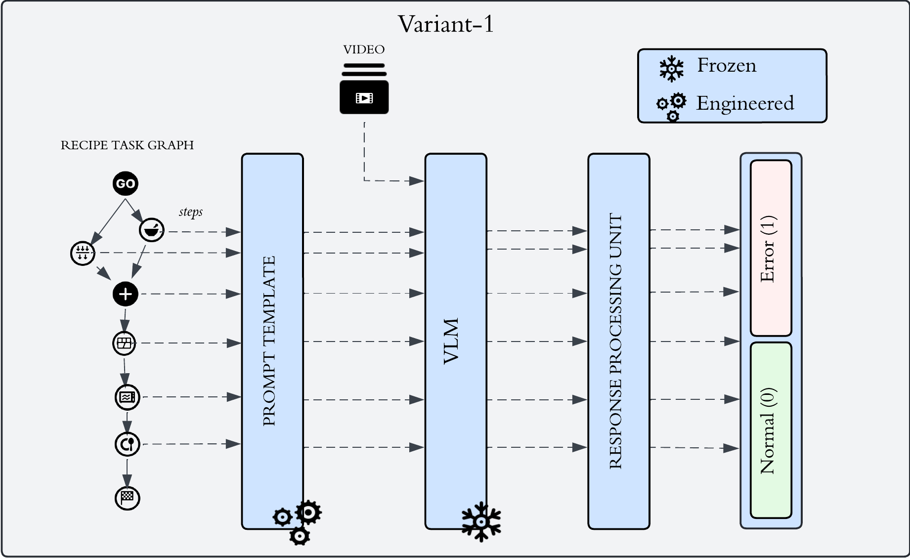

# Error Category Recognition in Procedural Videos with Vision-Language Models

This repository contains the code and models used for the thesis **"Error Category Recognition in Procedural Videos with Vision-Language Models"**, which explores the use of Vision-Language Models (VLMs) for recognizing procedural errors in instructional videos. The models, **Video-LLaVA** and **TimeChat**, are used for zero-shot error recognition on the **CaptainCook4D** dataset.

## Dataset
The **CaptainCook4D** dataset is used for this project, which contains 384 cooking videos with detailed annotations for step-by-step task performance, including both error-free and error-prone recordings. \
\
The **CaptainCook4D** dataset must be downloaded separately. The dataset can be downloaded from the [official website](https://captaincook4d.github.io/captain-cook/).

## Models
### Video-LLaVA
The Video-LLaVA model is an extension of the LLaVA model with video processing capabilities. It uses a multimodal approach, combining vision and language to recognize errors in instructional videos. The model is capable of zero-shot error recognition by analyzing video data and textual task descriptions.

For more details, visit the [Video-LLaVA](https://github.com/bhavyaalekhya/Video-LLaVA) submodule.

### TimeChat
TimeChat is a time-sensitive multimodal model designed for understanding long-form videos. It uses a sliding Q-Former mechanism to handle temporal localization and long video sequences, making it suitable for identifying procedural errors across multiple steps.

For more details, visit the [TimeChat](https://github.com/bhavyaalekhya/evaluation_suite/tree/main/Video-LMMs-Inference/TimeChat) submodule.

## Task Verification and Error Category Recognition

### Task Verification (Variant 1)
 

Task Verification checks whether each procedural step in a video was completed correctly. By feeding a series of prompts, the model predicts if an action was successfully performed. This helps verify whether all instructions were followed accurately.

### Error Category Recognition (Variant 2)
 

Error Category Recognition focuses on identifying specific error types (e.g., missing steps, measurement errors) in the video. The model uses multiple prompts to assess various error categories, providing a more detailed analysis of mistakes.

## Results
The results from our experiments include metrics such as **precision**, **recall**, and **F1 scores** for both Task Verification (Variant 1) and Error Category Recognition (Variant 2).